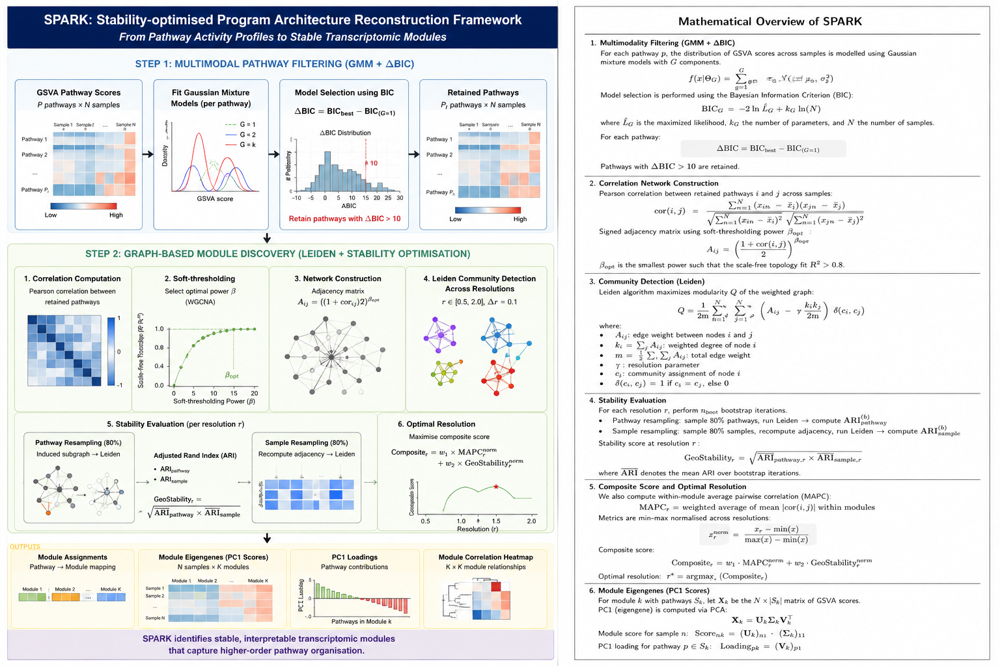

# SPARK

## Stability-optimised Program Architecture Reconstruction frameworK

SPARK is a graph-based transcriptomic framework for identifying stable, coordinated pathway modules from pathway activity landscapes using multimodality filtering, network-based organisation, Leiden community detection, and stability optimisation.

The framework reconstructs higher-order transcriptomic programs from GSVA-derived pathway activity matrices and is designed for robust pathway-level systems biology analyses in cancer and complex biological systems.

---

# Workflow Overview



---

# Overview

SPARK combines:

* Gaussian mixture model (GMM)-based multimodal pathway filtering
* Bayesian Information Criterion (ΔBIC)-driven pathway selection
* Signed pathway co-activity network construction
* WGCNA-inspired soft-thresholding
* Leiden graph community detection
* Bootstrap stability optimisation
* Principal component-derived module eigengenes

to identify stable transcriptomic pathway modules representing coordinated biological programs.

---

# Features

* Multimodal pathway filtering using Gaussian mixture models
* ΔBIC-based identification of biologically informative pathways
* Graph-based pathway organisation
* Resolution-wise Leiden community detection
* Stability-aware module optimisation
* Bootstrap-adjusted Rand Index (ARI) evaluation
* Principal component-based module summarisation
* Publication-ready module-level outputs and diagnostics

---

# Repository Structure

```text
SPARK_repository/
│
├── README.md
├── LICENSE
├── .gitignore
│
├── scripts/
│   ├── 01_gmm_multimodal_filtering.R
│   ├── 02_graph_module_discovery.R
│   └── run_spark_pipeline.R
│
├── example_data/
│   └── GSVA_scores.csv
│
├── example_output/
│   ├── gmm_filtering/
│   └── module_discovery/
│
├── docs/
│   ├── workflow_schematic.png
│   ├── mathematical_overview.pdf
│   ├── methodology.md
│   └── parameter_descriptions.md
│
└── environment/
    ├── required_packages.R
    └── sessionInfo.txt
```

---

# Installation

## Clone Repository

```bash
git clone https://github.com/rdk004/SPARK.git
cd SPARK
```

---

# Install Dependencies

Open R and run:

```r
source("environment/required_packages.R")
```

---

# Input Data

SPARK requires a GSVA pathway activity matrix where:

* rows represent pathways
* columns represent samples
* values represent GSVA enrichment scores

Place the matrix inside:

```text
example_data/GSVA_scores.csv
```

---

# Running SPARK

Run the complete pipeline using:

```r
source("scripts/run_spark_pipeline.R")
```

The workflow sequentially performs:

1. Multimodal pathway filtering
2. Correlation network construction
3. Leiden-based module discovery
4. Stability optimisation
5. Module eigengene generation

---

# Workflow Components

## 1. Multimodal Pathway Filtering

Pathways are evaluated using Gaussian mixture models (GMMs).

Model selection is performed using the Bayesian Information Criterion (BIC):

```math
\Delta BIC = BIC_{best} - BIC_{G=1}
```

Pathways with:

```math
\Delta BIC > 10
```

are retained for downstream graph analysis.

---

## 2. Graph-based Module Discovery

A signed pathway co-activity network is constructed using pathway-pathway correlations across samples.

Soft-thresholding is performed using WGCNA-inspired adjacency transformation:

```math
A_{ij} = \left(\frac{1 + cor(i,j)}{2}\right)^\beta
```

Leiden community detection is then performed across multiple resolutions.

---

## 3. Stability Optimisation

For each resolution:

* bootstrap pathway resampling is performed
* bootstrap sample resampling is performed
* Adjusted Rand Index (ARI) stability is computed

Resolution selection is based on a composite score integrating:

* module coherence (MAPC)
* graph stability

---

## 4. Module Eigengene Generation

For each identified module:

* principal component analysis (PCA) is performed
* PC1 is used as the module eigengene
* pathway PC1 loadings are exported

These eigengenes represent coordinated transcriptomic pathway programs.

---

# Outputs

## GMM Filtering Outputs

Located in:

```text
example_output/gmm_filtering/
```

Includes:

* ΔBIC statistics
* retained pathway lists
* filtered GSVA matrices
* multimodality diagnostic plots

---

## Module Discovery Outputs

Located in:

```text
example_output/module_discovery/
```

Includes:

* module assignments
* module eigengene matrices
* PC1 loading matrices
* resolution optimisation metrics
* module correlation heatmaps

---

# Documentation

Additional methodological details are available in:

```text
docs/
```

Including:

* workflow schematic
* mathematical overview
* parameter descriptions
* methodological summaries

---

# Reproducibility

The repository includes:

* dependency installation scripts
* session information
* example input data
* example output files

for reproducible execution.

Environment information is provided in:

```text
environment/sessionInfo.txt
```

---

# Citation

If you use SPARK in your work, please cite the associated manuscript.

Rishabh Kulkarni
SPARK: Stability-optimised Program Architecture Reconstruction Framework
(Manuscript in preparation)

---

# Contact

Rishabh Kulkarni
Indian Institute of Science Education and Research (IISER) Pune

---

# License

This project is released under the MIT License.
